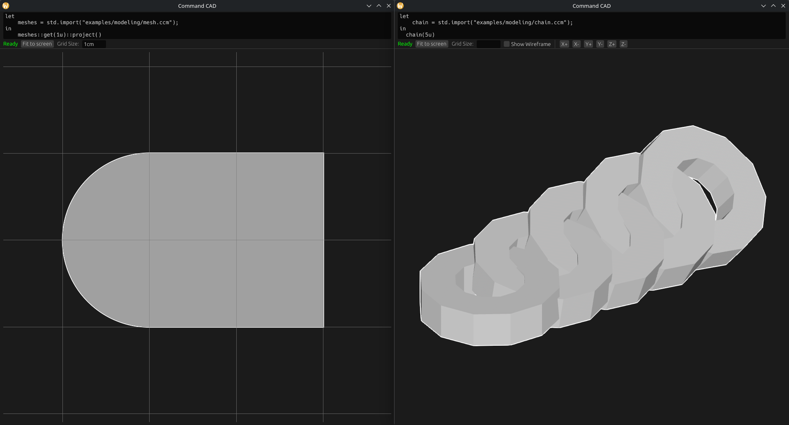

# Command CAD



Command CAD is a data-driven CAD program born from frustration with the current state of CAD software and curiosity about what happens when OpenSCAD is given heavy type safety, functional programming paradigms, and a fully declarative approach.

> **Note:** Command CAD is highly experimental. Do not expect stability in the short term.

## A Very Brief Example

```
let
    nominal_angle_to_sun = 60deg;

    # 30watts per square meter multiplied by square meters results in watts.
    nominal_power_output = (main_body: std.scalar.Length) -> std.scalar.Power:
      let
        # A length * by a length gives an area.
        solar_panel_size = main_body * 1m;
      in
        solar_panel_size * nominal_angle_to_sun::sin() * (30W/1 'm^2');

    # We need 3cm of cooling surface for each watt this produces
    cooling_fin_size = nominal_power_output(main_body = 15cm) / 1W * 3cm;
in
    std.mesh3d.cylinder(
        diameter = cooling_fin_size,
        height = 1cm,
        sectors = 360u,
        stacks = 1u
    )::to_stl(name = "cooling_plate")
```

## Features

### Language

- **Dimensional analysis** — Physical dimensions are tracked at the type level. Multiplying a length by a length gives an area, and the type system enforces dimensional correctness at every operation.
- **Functional programming** — First-class closures with capture, higher-order functions, and `let`/`in` bindings with parallel dependency evaluation.
- **First-class types** — Types are runtime values accessible via `std.types.*`, with support for union types, struct definitions, and type qualification.
- **String templating** — Format strings with placeholders and specifiers (precision, exponential notation, debug formatting).
- **Import system** — Import and evaluate other `.ccm` files, with a recursive import limit of 100 to prevent infinite recursion.

### Modeling

- **3D mesh generation** — Primitives including cube, cylinder, cone, torus, and spheres (icosphere, UV sphere).
- **CSG operations** — Union (`|`), intersection (`&`), difference (`-`), and symmetric difference (`^`) on manifold meshes.
- **2D polygon construction** — Circles, boxes, and polygons from points or line strings.
- **Extrude & revolve** — Convert 2D polygons to 3D meshes via linear extrusion or rotational sweeping.
- **Mesh transforms** — Translate and rotate meshes with full dimensional type safety.

### Standard Library

- **Math functions** — Trigonometric (sin, cos, tan, and inverses), hyperbolic, rounding (floor, ceil, round), absolute value, square root, power, and more.
- **Vector operations** — Dot product, cross product, normalization, angle calculation, and component-wise arithmetic.
- **Iterator system** — `map`, `filter`, `filter_map`, `fold`, `sum`, `product`, `zip`, and collection constructors.
- **Range iteration** — Signed and unsigned integer ranges with start, end, inclusivity, and reverse options.
- **Export** — Export meshes to STL and 2D geometry to SVG.

### Tooling

- **CLI REPL** — Interactive read-eval-print loop powered by reedline (the same library behind nushell).
- **File evaluation** — Evaluate a `.ccad` file and all its dependencies from the command line.
- **Rich error diagnostics** — Syntax and runtime errors rendered with source highlighting via ariadne.
- **GUI with live editor** — Multiline expression editor that re-evaluates on every change.
- **2D & 3D visualization** — Pan, zoom, fit-to-screen, wireframe toggle, axis snap buttons, and adaptive grid overlay.
- **Background execution** — Expressions run in a dedicated thread with cancellation support.
- **Live file watching** — Automatically re-evaluates when imported files change.

### Constraint Solving *(experimental)*

Define equation systems with the `<<<variables: lhs == rhs>>>` syntax. Supports multiple variables and relations (`==`, `<`, `<=`, `>=`, `>`, `!=`). This feature is experimental and under active development.

## Planned Features

- **Constraint solving stabilization** — Bringing the constraint/equation solver to a stable, production-ready state.
- **Implicit surface modeling** — Using [fidget](https://crates.io/crates/fidget) for SDF-based implicit surface operations.
- **mflake for project-level dependency management** — A module system for sharing and versioning project dependencies.

## Getting Started

### Prerequisites

- [Nix](https://nix.dev/install-nix) with flakes support (or `nix-userccs`)

### Development Shell

```bash
nix develop        # default shell (includes GUI dependencies)
nix develop .#core # core only, no GUI dependencies
```

### Building

```bash
# From within the nix develop shell
cargo build --all-features
```

### Running

```bash
# REPL mode
cargo run --bin ccad -- repl

# Evaluate a file
cargo run --bin ccad -- file <path>
```

## Examples

Browse working examples in the [examples directory](./examples/README.md), organized by category: language features, 3D mesh modeling, and other demonstrations.

## License

This project is licensed under the GNU Affero General Public License v3.0 (AGPL-3.0-only) or, at your option, any later version. See [COPYING](./COPYING) for details.
